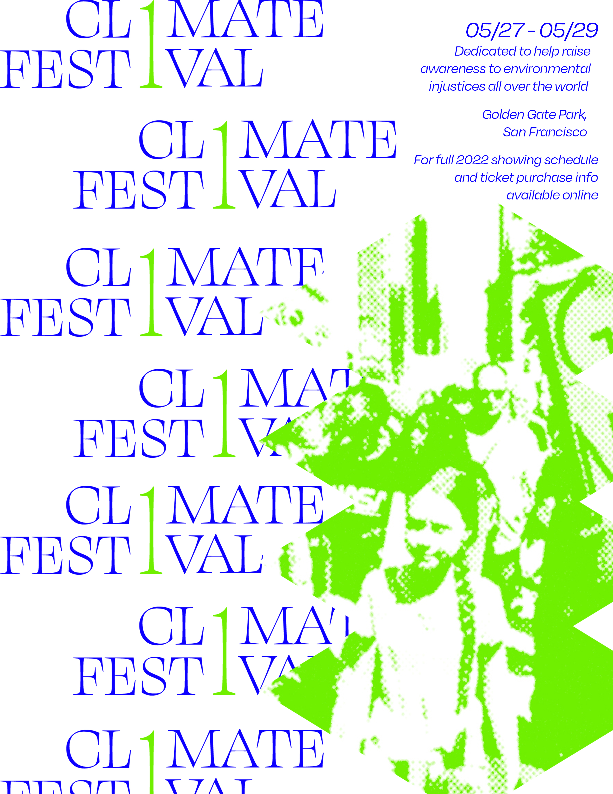

# Sabrina's Project 03

## Project Overview

<h5>CL1MATE is a festival dedicated to raise awareness on environmental injustices. Additionally, it aims to reach an international audience so that everyone in the world can hopefully learn more about how  environmental issues align with different social issues (classism, racism, etc). By using various visual elements, such as illustrations and collages, this will help the audience break down complex issues that revolve around environmental abuse. </h5>
 

## Technical Overview
<h5>This project consist of HTML and CSS. In addition to this, there will be a use of graphics (made by me) and various font families which are listed below:

Paralucent Family
https://fonts.adobe.com/fonts/paralucent

Degular Family
https://fonts.adobe.com/fonts/degular

Swear Display Family
https://fonts.adobe.com/fonts/swear-display

Click the link below to access the CL1MATE festival's website wireframe
https://xd.adobe.com/view/cb382b0f-7b9b-4c95-9aec-43a67619207e-9e6b/

See Mockups below:

### Acknowledgment
<h5>
Automatic Image Slider -- https://www.youtube.com/watch?v=j18CH0Grhbw&ab_channel=CodeInstinct

Collapsible menu -- https://codepen.io/markcaron/pen/RVvmaz
<h5>